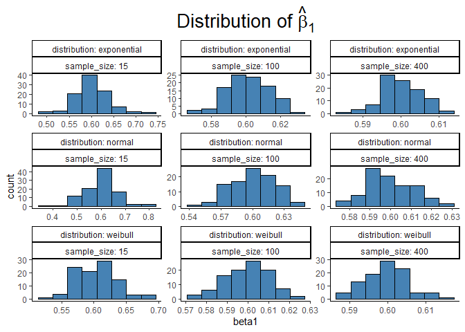
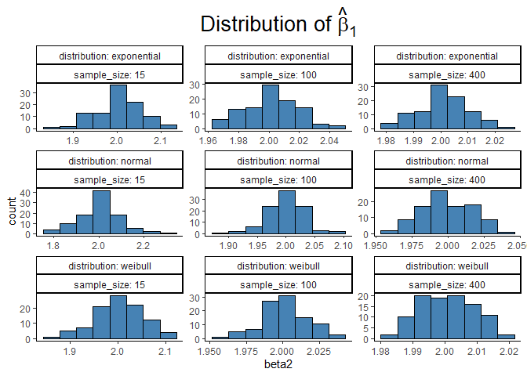

How does Ordinary Least Square estimator behave if the residuals are not
normally distributed? Ever thought of that? Usually we check whether the
residuals are following normal distribution or not. But how important is
this assumption? Say, we have continuous x,y variable, ignoring the
discrete case, as discrete y usually brings GLM with it.

Let’s consider the follwoing distributions for the residual and generate
data.

-   Exponential
-   Normal
-   Weibull

You can choose other distributions too. But for this instance, these are
good to compare.

We will simulate data for the follwoing model:

*Y* = 15 + 0.6*X*1 + 2*X*2 + *U*

For this work, we have chosen *X*1 and *X*2 to be
generated from uniform distribution. We have taken 100 iteration for
samples of sizes : 15, 100 and 400

    # install the required packages crom CRAN at first
    # install.packages("tidyverse")
    # install.packages("kableExtra")
    # install.packages("latex2exp")

    set.seed(123)
    library(tidyverse)
    library(kableExtra)
    library(latex2exp)
    simulate <- function(x, n, distribution, ...){
      u <- if (distribution == "exponential") {
        rexp(n, ...)
      } else if (distribution == "weibull") {
        rweibull(n, ...)
      } else if (distribution == "normal") {
        rnorm(n, ...)
      } else {
        stop("Unsupported distribution")
      }
      x1 = runif(n, min = 45, max = 60)
      
      x2 = runif(n, min = 20, max = 30)
      
      
      y = 15+ 0.6 * x1 + 2 * x2 + u
      
      fit <- lm(y~x1+x2) |> summary()
      result <- data.frame(
        distribution = distribution,
        sample_size = n,
        beta1 = fit$coefficients[2],
        beta2 = fit$coefficients[3])
      return(result)
    }

    sim_result <- pmap_df(list(x = 1:900,
                               n = rep(c(rep(15,100),
                                     rep(100, 100), 
                                     rep(400, 100)),3),
                               distribution = c(rep("exponential", 300),
                                                rep("weibull", 300),
                                                rep("normal", 300)),
                               c(rate = rep(2, 300),
                                    shape = rep(2,300),
                                    mean = rep(0,300))), 
                          .f= simulate)

    simulation <- sim_result %>% group_by(sample_size, distribution) %>% summarise(across(beta1:beta2, 
                     list(mean = ~round(mean(.x),3),
                          sd = ~round(sd(.x), 3)), 
                     .names = "{.col}_{.fn}")) %>% mutate(sample_size = as.numeric(sample_size)) %>% arrange(sample_size) %>% 
      mutate(distribution = str_to_title(distribution)) %>%  rename_with(str_to_title)
    simulation |> kable(align = "c")

<table>
<colgroup>
<col style="width: 18%" />
<col style="width: 19%" />
<col style="width: 16%" />
<col style="width: 14%" />
<col style="width: 16%" />
<col style="width: 14%" />
</colgroup>
<thead>
<tr class="header">
<th style="text-align: center;">Sample_size</th>
<th style="text-align: center;">Distribution</th>
<th style="text-align: center;">Beta1_mean</th>
<th style="text-align: center;">Beta1_sd</th>
<th style="text-align: center;">Beta2_mean</th>
<th style="text-align: center;">Beta2_sd</th>
</tr>
</thead>
<tbody>
<tr class="odd">
<td style="text-align: center;">15</td>
<td style="text-align: center;">Exponential</td>
<td style="text-align: center;">0.601</td>
<td style="text-align: center;">0.036</td>
<td style="text-align: center;">2.004</td>
<td style="text-align: center;">0.050</td>
</tr>
<tr class="even">
<td style="text-align: center;">15</td>
<td style="text-align: center;">Normal</td>
<td style="text-align: center;">0.598</td>
<td style="text-align: center;">0.067</td>
<td style="text-align: center;">2.006</td>
<td style="text-align: center;">0.091</td>
</tr>
<tr class="odd">
<td style="text-align: center;">15</td>
<td style="text-align: center;">Weibull</td>
<td style="text-align: center;">0.603</td>
<td style="text-align: center;">0.031</td>
<td style="text-align: center;">2.002</td>
<td style="text-align: center;">0.051</td>
</tr>
<tr class="even">
<td style="text-align: center;">100</td>
<td style="text-align: center;">Exponential</td>
<td style="text-align: center;">0.601</td>
<td style="text-align: center;">0.012</td>
<td style="text-align: center;">2.002</td>
<td style="text-align: center;">0.017</td>
</tr>
<tr class="odd">
<td style="text-align: center;">100</td>
<td style="text-align: center;">Normal</td>
<td style="text-align: center;">0.600</td>
<td style="text-align: center;">0.021</td>
<td style="text-align: center;">1.999</td>
<td style="text-align: center;">0.034</td>
</tr>
<tr class="even">
<td style="text-align: center;">100</td>
<td style="text-align: center;">Weibull</td>
<td style="text-align: center;">0.600</td>
<td style="text-align: center;">0.011</td>
<td style="text-align: center;">2.001</td>
<td style="text-align: center;">0.016</td>
</tr>
<tr class="odd">
<td style="text-align: center;">400</td>
<td style="text-align: center;">Exponential</td>
<td style="text-align: center;">0.600</td>
<td style="text-align: center;">0.005</td>
<td style="text-align: center;">2.001</td>
<td style="text-align: center;">0.009</td>
</tr>
<tr class="even">
<td style="text-align: center;">400</td>
<td style="text-align: center;">Normal</td>
<td style="text-align: center;">0.600</td>
<td style="text-align: center;">0.011</td>
<td style="text-align: center;">1.999</td>
<td style="text-align: center;">0.018</td>
</tr>
<tr class="odd">
<td style="text-align: center;">400</td>
<td style="text-align: center;">Weibull</td>
<td style="text-align: center;">0.600</td>
<td style="text-align: center;">0.006</td>
<td style="text-align: center;">2.001</td>
<td style="text-align: center;">0.008</td>
</tr>
</tbody>
</table>

we may want to generate the distribution of *β̂*1 and
*β̂*2

    ggplot(sim_result)+
      geom_histogram(aes(beta1),
                     bins = 8, 
                     fill = "steelblue", 
                     color = "black")+
      labs(title = expression(paste("Distribution of ",hat(beta)[1])))+ # used exp
      facet_wrap(~distribution+sample_size, 
                 scales = "free",
                 labeller = label_both)+
      theme_classic()+
      theme(plot.title = element_text(hjust = 0.5,
                                      size = 20, 
                                      color = "black"))

    library(latex2exp)
    ggplot(sim_result)+
      geom_histogram(aes(beta2),
                     bins = 8, fill = "steelblue",
                     color = "black")+
      facet_wrap(~distribution+sample_size, 
                 scales = "free",
                 labeller = label_both)+
      
      labs(title = TeX("Distribution of $\\hat{\\beta}_1$"))+ # used latex2exp
      
      theme_classic()+
      theme(plot.title = element_text(hjust = 0.5, 
                                      size = 20, 
                                      color = "black"))

The Table of means and standard errors for the residual following
different distributions for different sample size, along with the plots
of the estimates clearly show that **violation of the normality
assumption has little to no impact on the biasness and efficiency of the
estimator.**
